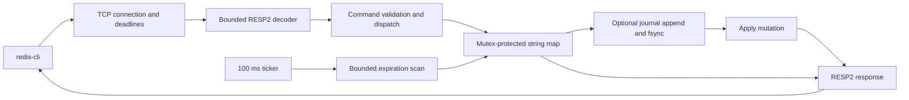

# NebulaKV

[](https://github.com/LuddEvergard3n/nebulakv/actions/workflows/ci.yml)

A small, educational in-memory string database written in Go, with a TCP server,
a hand-built RESP2 codec, atomic commands, key expiration and an append-only journal.
The runtime has **no third-party Go dependencies** and does not use Redis internally.

Inspired by [Build Your Own X](https://github.com/codecrafters-io/build-your-own-x).
Protocol behavior is based on the [RESP specification](https://redis.io/docs/latest/develop/reference/protocol-spec/)
and [SET documentation](https://redis.io/docs/latest/commands/set/).

## Features

- Binary-safe string keys and values; RESP2 serialization and bounded parsing.
- Concurrent TCP clients, pipelining, read/write deadlines and graceful shutdown.
- Atomic multi-key operations and integer increments; conditional SET with old-value return.
- Millisecond deadlines, lazy expiration and bounded periodic cleanup.
- Optional synchronous journal, checksummed records, restart replay and truncated-tail recovery.
- Exclusive journal ownership on Windows, Linux, macOS and FreeBSD; Windows/Linux tested.
- Command introspection, counters, deterministic tests and reproducible benchmarks.
- A non-root, multi-stage Docker image and Windows/Linux CI configuration.
- Optional per-connection AUTH from a password file, with constant-time digest comparison.
- A configurable dataset budget with atomic no-eviction rejection.
- Manual/automatic AOF compaction with protected replacement and recovery tests.
- Authenticated asynchronous primary/replica synchronization with read-only replicas.

## Quick start

Use Go 1.27+ (the module's minimum language version is 1.26):

```sh
go run ./cmd/nebulakv
# Or build a standalone executable:
go build -trimpath -o bin/nebulakv ./cmd/nebulakv
./bin/nebulakv --appendonly --data ./data
```

Windows in this workshop, including the portable Go installation:

```powershell
.\scripts\verify.ps1
.\bin\nebulakv.exe --appendonly --data .\data
```

`--help` lists every flag. Defaults: `127.0.0.1:6380`, persistence off,
64 connections, a 64 MiB accounted dataset budget, 30-second command read deadline, 5-second response write deadline,
and 5-second shutdown drain. Logs go to stderr; keys and values are not logged.
Other flags: `--host`, `--port`, `--log-level`, `--max-clients`, `--read-timeout`,
`--write-timeout`, `--shutdown-timeout`, `--appendonly`, `--data`.

For AUTH, `--maxmemory`, `REWRITEAOF` and replication flags, see
[the configuration and failure guide](docs/HARDENING.md). Defaults remain local:
AUTH is enabled only when a password file is supplied, and replication is opt-in.

## redis-cli demo

```sh
redis-cli -p 6380 PING
redis-cli -p 6380 SET greeting hello
redis-cli -p 6380 GET greeting
redis-cli -p 6380 SET greeting replacement NX GET
redis-cli -p 6380 SET session temporary PX 10000
redis-cli -p 6380 PTTL session
redis-cli -p 6380 INCR visits
redis-cli -p 6380 INFO
```

With persistence enabled, stop and restart the server with the same data directory:
`greeting` remains, while elapsed expiration time is not reset.
The automated Docker smoke test uses the official Redis image **only as a client**.

## Architecture and request flow



A connection handler reads one bounded frame, validates argument types and arity,
and dispatches it. Storage acquires its lock once per operation. Persistent writes
append and synchronize their record before modifying the map. The response is
serialized after the operation returns. Buffered pipelined requests use the same
connection without losing unread bytes.

See [ARCHITECTURE.md](ARCHITECTURE.md) for locking, replay and failure semantics.

## Commands

| Area | Supported commands |
| --- | --- |
| Connectivity | `PING [message]`, `ECHO message`, `QUIT` |
| Authentication | `AUTH password`, `AUTH default password` |
| Strings | `SET key value [EX seconds | PX milliseconds] [NX | XX] [GET]`, `GET key` |
| Multiple keys | `DEL key...`, `EXISTS key...`, `MGET key...`, `MSET key value...` |
| Counters | `INCR key`, `DECR key` — signed 64-bit, checked overflow |
| Expiration | `EXPIRE key seconds`, `PEXPIRE key milliseconds`, `TTL key`, `PTTL key`, `PERSIST key` |
| Inspection | `TYPE key`, `DBSIZE`, `KEYS pattern`, `INFO` |
| Administration | `FLUSHDB`, `COMMAND`, `COMMAND COUNT`, `COMMAND INFO name...` |
| Persistence | `REWRITEAOF` — synchronous NebulaKV extension |
| Client setup | `SELECT 0`, `CLIENT SETINFO name value` (accepted without storing metadata) |

`EXISTS` counts duplicate arguments; `DEL` deletes each key at most once. `MSET`
is atomic and clears previous TTLs. A successful SET clears TTL unless EX/PX is
provided. SET GET returns the previous value even when NX prevents replacement.
NX+XX and multiple expiry options are rejected. TTL/PTTL use `-2` for absent keys
and `-1` for persistent keys. TTL rounds remaining milliseconds to the nearest second.
Nonpositive EXPIRE/PEXPIRE deletes an existing key immediately.

KEYS supports byte-based `*`, `?`, ranges, `[^...]` and backslash escapes.
Unclosed character classes match nothing. Patterns are limited to 256 bytes;
matching treats `/` as an ordinary byte. Unicode character-aware globbing is not claimed.

## Docker

```sh
docker build -t nebulakv:local .
docker run --rm --memory 256m --memory-swap 256m -p 127.0.0.1:6380:6380 nebulakv:local
# Preserve data beyond container removal with an explicitly named volume:
docker run --rm --memory 256m --memory-swap 256m -p 127.0.0.1:6380:6380 -v nebulakv-data:/data \
  nebulakv:local --host 0.0.0.0 --appendonly --data /data
```

The final image contains a static binary and an owned data directory, runs as UID
65532 and has no shell. Its build stage runs formatting, vet and race tests.
Bind mounts must be writable by this UID. Local port binding above prevents
accidental public exposure. AUTH can restrict access, but the transport does not
provide TLS. Keep this educational service on trusted local/private networks.

```powershell
.\scripts\docker-smoke.ps1
.\scripts\resilience-smoke.ps1
```

On Linux: `bash scripts/docker-smoke.sh nebulakv:local`.
The smoke scripts clean up their own temporary containers. The resilience script
also creates an isolated network, a temporary test password and two servers with
Docker memory ceilings. It tests authentication, atomic OOM rejection, compaction,
replication and reconnection after abrupt primary restart.

## Tests and validation

```sh
gofmt -l cmd internal
go vet ./...
go test ./...
go test -race ./...    # requires a supported platform and C compiler
go test ./internal/resp -run '^$' -fuzz FuzzDecoder -fuzztime=5s -parallel=4
go build ./cmd/nebulakv
```

Tests exercise fragmented TCP input, malformed lengths, frame budgets, integer
overflow, conditional writes, expiration boundaries, concurrent increments,
atomic MSET/MGET, binary replay, truncation, corruption and journal ownership.
Clock-based expiry tests do not sleep. Real network tests use ephemeral ports and
bounded failure deadlines. The external CLI walkthrough deliberately allows wall time to elapse.

See [docs/VALIDATION.md](docs/VALIDATION.md) for what actually ran. GitHub Actions
validates Windows, Linux and Docker on every push and pull request.

## Benchmarks

```sh
go test ./internal/storage -run '^$' -bench . -benchmem -benchtime=250ms -count=3
# A separate TCP benchmark, with a running server and Redis tools installed:
redis-benchmark -p 6380 -t set,get -n 10000 -c 16 -P 4
```

The measured storage run is in [docs/BENCHMARKS.md](docs/BENCHMARKS.md), including
raw results, workload and hardware. GET and replacement SET allocated **0 B/op**
in that memory-only microbenchmark. This excludes parsing, networking, new-key
growth and persistence. No throughput claim for production workloads is made.

## Decisions, trade-offs and limitations

- A single mutex makes command atomicity and journal ordering explainable. It
  serializes requests; slow disk synchronization also blocks reads.
- Immutable Go strings avoid copying stored values on GET. Parser allocations,
  map growth and replies still consume memory.
- Active expiration checks at most 128 map entries every 100 ms. Go map iteration
  is not a fair scheduler; lazy expiration is authoritative and cleanup latency
  is not guaranteed for very large maps.
- INFO, DBSIZE and KEYS scan the map while locked. Avoid them in latency-sensitive workloads.
- Limits: 1 MiB per bulk string, 8 MiB per input frame, 1,024 elements per array,
  4,096 total values, depth 8 and 4 KiB header lines. Dataset admission accounts for
  key/value bytes plus 96 bytes per entry. This is not a process RSS measurement;
  use Docker memory limits for a process ceiling. Eviction and response caps are absent.
- RESP2 command arrays only: no inline protocol, RESP3, TLS, transactions, Lua,
  pub/sub, lists, sets, hashes or multiple databases.
  INFO sections and most CLIENT/COMMAND subcommands are unsupported.
- The AOF is NebulaKV-specific, not Redis's file format. JSON base64 increases
  disk usage. Compaction is synchronous and holds the store lock. Backup tooling
  and online repair of corrupt journals are not implemented.
- Replication polls revisions and transfers a full snapshot only after changes.
  It does not implement Redis PSYNC, incremental replication, consensus or automatic
  failover. Reads may lag; after a disconnect, the last complete snapshot remains available.
- File synchronization and checksums do not establish hardware/power-loss durability.
  A failed write has an uncertain disk outcome; retry requires restart and inspection.
- This is an educational implementation, not a production Redis replacement.

## Repository structure

```text
cmd/nebulakv/          executable and process lifecycle
internal/resp/        bounded parser, serializer, fuzz seeds
internal/storage/     atomic operations, expiration, glob matching, benchmarks
internal/command/     validation, dispatch and command catalog
internal/server/      TCP lifecycle and statistics
internal/persistence/ journal, replay and operating-system locks
internal/replication/ bounded snapshot receiver and reconnect loop
internal/config/      command-line configuration
scripts/              reproducible verification and demos
docs/                 milestones, evidence, benchmarks and interview walkthrough
.github/workflows/    Windows/Linux checks and container smoke test
```

## Roadmap

The core and the four requested extensions are implemented. Further milestones:
cursor-based SCAN, optional eviction policies, incremental replication, TLS, a richer
compatibility matrix and representative TCP/persistence benchmarks before sharding.

## What this project teaches

TCP reads do not correspond to messages. Multi-key correctness requires a clear
atomicity boundary. Durability is an ordering and failure-handling problem, not just
file output. Relative TTLs must become absolute deadlines before persistence.
Useful optimization starts with an observed cost and a constrained measurement.
